# 🧠 CSE 475 Lab Assignment 02: Semi-Supervised & Self-Supervised Learning for Brain MRI Detection

[](https://www.python.org/downloads/)
[](https://pytorch.org/)
[](https://github.com/ultralytics/ultralytics)
[](LICENSE)

> **Course**: CSE 475 - Machine Learning 
> **Assignment**: Lab Assignment 02  
> **Topic**: Semi-Supervised & Self-Supervised Learning for Medical Image Analysis

---

## 📓 Kaggle Notebooks

<div align="center">

### 🚀 Complete Pipeline - Click to View Interactive Notebooks

<table>
  <tr>
    <th>Step</th>
    <th>Notebook</th>
    <th>Description</th>
    <th>Link</th>
  </tr>
  <tr>
    <td align="center">1️⃣</td>
    <td><b>Data Preparation & EDA</b></td>
    <td>Dataset analysis, preprocessing, and exploration</td>
    <td><a href="https://www.kaggle.com/code/turjo410/01-data-preparation-eda"></a></td>
  </tr>
  <tr>
    <td align="center">2️⃣</td>
    <td><b>SSOD YOLO Pseudo-labeling</b></td>
    <td>Semi-supervised object detection with pseudo-labels</td>
    <td><a href="https://www.kaggle.com/code/turjo410/02-ssod-yolo-pseudolabel-final3acc34ed50"></a></td>
  </tr>
  <tr>
    <td align="center">3️⃣</td>
    <td><b>SimCLR Pretraining</b></td>
    <td>Self-supervised contrastive learning pretraining</td>
    <td><a href="https://www.kaggle.com/code/turjo410/03-1-simclr-pretrainingdcec1c9968"></a></td>
  </tr>
  <tr>
    <td align="center">4️⃣</td>
    <td><b>SimCLR Fine-tuning</b></td>
    <td>Transfer learning and YOLO integration</td>
    <td><a href="https://www.kaggle.com/code/turjo410/03-2-simclr-finetuning1a4c18f8e5"></a></td>
  </tr>
  <tr>
    <td align="center">5️⃣</td>
    <td><b>DINOv3 Feature Extraction</b></td>
    <td>Self-supervised vision transformer features</td>
    <td><a href="https://www.kaggle.com/code/archariox/04-1-dinov3-featureextraction"></a></td>
  </tr>
  <tr>
    <td align="center">6️⃣</td>
    <td><b>DINOv3 Fine-tuning</b></td>
    <td>Classifier training and YOLO detection</td>
    <td><a href="https://www.kaggle.com/code/archariox/04-2-dinov3-finetuning"></a></td>
  </tr>
</table>

**📌 Note**: All notebooks are fully executable on Kaggle with GPU acceleration enabled.

</div>

---

## 📋 Table of Contents

- [Project Overview](#-project-overview)
- [Key Results Summary](#-key-results-summary)
- [Repository Structure](#-repository-structure)
- [Notebooks Description](#-notebooks-description)
  - [01: Data Preparation & EDA](#1%EF%B8%8F⃣-data-preparation--eda)
  - [02: Semi-Supervised Object Detection (SSOD)](#2%EF%B8%8F⃣-semi-supervised-object-detection-ssod)
  - [03-1: SimCLR Pretraining](#3%EF%B8%8F⃣-simclr-self-supervised-pretraining)
  - [03-2: SimCLR Fine-tuning](#4%EF%B8%8F⃣-simclr-fine-tuning)
  - [04-1: DINOv3 Feature Extraction](#5%EF%B8%8F⃣-dinov3-feature-extraction)
  - [04-2: DINOv3 Fine-tuning](#6%EF%B8%8F⃣-dinov3-fine-tuning)
- [Methodology](#-methodology)
- [Results & Metrics](#-results--metrics)
- [Visualizations](#-visualizations)
- [Installation & Usage](#-installation--usage)
- [Model Weights](#-model-weights)
- [References](#-references)

---

## 🎯 Project Overview

This project implements **Semi-Supervised Learning (SSL)** and **Self-Supervised Learning** techniques for **Brain MRI Object Detection**. The goal is to leverage both labeled and unlabeled medical imaging data to improve detection performance for three brain conditions:

| Class | Description |
|-------|-------------|
| **CCT** | Cerebral Cortex Tumor |
| **IFC** | Intracerebral Fluid Collection |
| **UAS** | Unidentified Anomaly Signature |

### 🔬 Learning Paradigms Explored

```
┌─────────────────────────────────────────────────────────────────────────┐
│                    ASSIGNMENT 2: LEARNING PARADIGMS                      │
├─────────────────────────────────────────────────────────────────────────┤
│                                                                          │
│  1️⃣ SEMI-SUPERVISED LEARNING (Notebook 02)                              │
│     └── Pseudo-Labelling with YOLOv12                                   │
│         • Teacher-Student Framework                                      │
│         • Confidence Threshold: τ = 0.70                                │
│         • Labeled: 20% | Unlabeled: 80%                                 │
│                                                                          │
│  2️⃣ SELF-SUPERVISED LEARNING - SimCLR (Notebooks 03-1, 03-2)           │
│     └── Contrastive Learning                                            │
│         • NT-Xent Loss                                                  │
│         • ResNet-18 Backbone                                            │
│         • Linear Eval + Full Fine-tuning                                │
│                                                                          │
│  3️⃣ SELF-SUPERVISED LEARNING - DINOv3 (Notebooks 04-1, 04-2)           │
│     └── Self-Distillation with No Labels v3                            │
│         • Vision Transformer (ViT-B/16)                                 │
│         • Feature Extraction + MLP Classification                       │
│         • YOLOv12 Integration                                           │
│                                                                          │
└─────────────────────────────────────────────────────────────────────────┘
```

---

## 🏆 Key Results Summary

### 📊 Object Detection Performance (mAP@50)

| Model | mAP@50 | mAP@50-95 | Precision | Recall | F1-Score |
|:------|:------:|:---------:|:---------:|:------:|:--------:|
| **Baseline (100% Data)** | **93.04%** | **64.59%** | 84.66% | 86.55% | 85.59% |
| Teacher (20% Data) | 81.84% | 53.92% | 72.11% | 79.34% | 75.55% |
| Student (Pseudo-Labeled) | 73.66% | 49.55% | 71.19% | 69.08% | 70.12% |
| **DINOv3 + YOLO** | **94.08%** | **67.73%** | 86.33% | 89.49% | **87.88%** |

### 📈 Classification Performance (Test Accuracy)

| Method | Accuracy | Precision | Recall | F1-Score |
|:-------|:--------:|:---------:|:------:|:--------:|
| SimCLR Linear Eval | 58.59% | 56.81% | 58.59% | 54.60% |
| **SimCLR Full Fine-tune** | **90.31%** | **90.33%** | **90.31%** | **90.31%** |
| DINOv3 + MLP | 89.45% | 89.50% | 89.45% | 89.47% |

### 🎯 Per-Class Detection (AP@50)

| Class | Baseline | Teacher | Student | DINOv3+YOLO |
|:------|:--------:|:-------:|:-------:|:-----------:|
| CCT | 95.18% | 77.37% | 76.53% | **96.21%** |
| IFC | 91.89% | 76.30% | 60.15% | **92.45%** |
| UAS | 92.06% | 91.85% | 84.29% | **93.58%** |

---

## 🎨 Visual Results Gallery

### 🏆 Best Model Performance - DINOv3 + YOLO (94.08% mAP@50)

<div align="center">

#### Detection Results & Confusion Matrix

*Training curves showing excellent convergence: Box loss, Object loss, and mAP metrics*


*Normalized confusion matrix showing high accuracy across all three classes*

</div>

---

### 📊 Model Comparison & Analysis

<div align="center">

#### Semi-Supervised Learning Results

*Teacher vs Student model performance comparison*

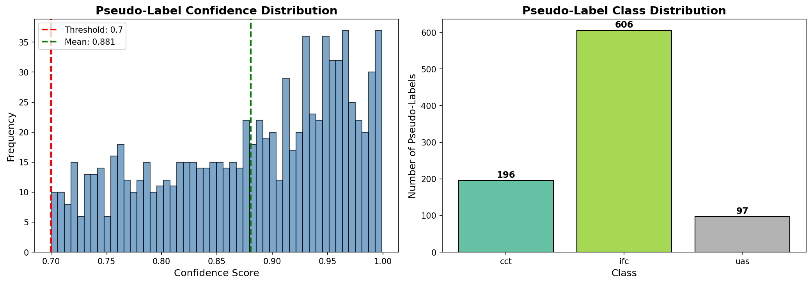
*Quality analysis of generated pseudo-labels*

</div>

---

### 🧬 SimCLR Self-Supervised Learning

<div align="center">

#### Training Progress
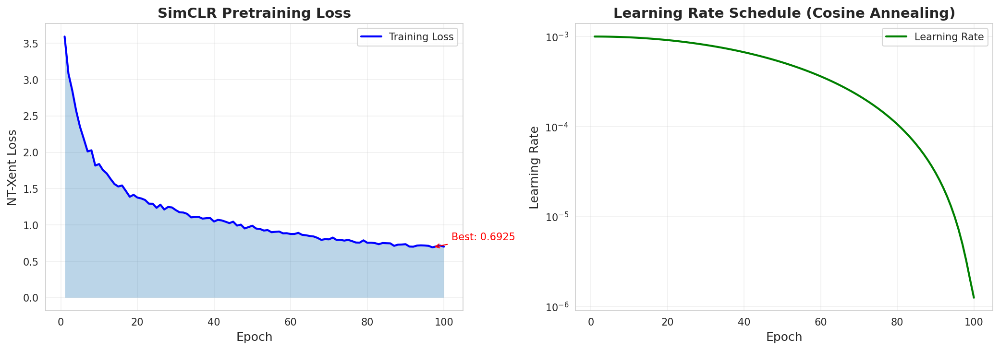
*Contrastive loss convergence over 100 epochs*

#### Feature Space Visualization
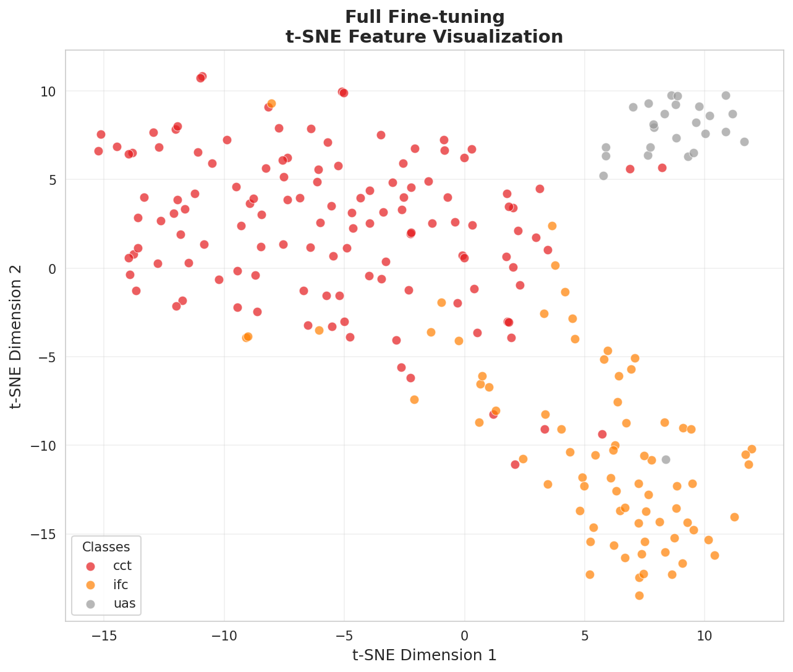
*t-SNE visualization showing clear class separation after fine-tuning*

#### Classification Performance
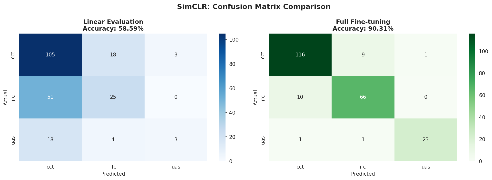
*Confusion matrices: Linear Evaluation (left) vs Full Fine-tuning (right)*

#### YOLO Object Detection Integration

*SimCLR + YOLOv12 detection results with bounding boxes and class counts*


*YOLO training curves and confusion matrix analysis*

</div>

---

### 🦖 DINOv3 Self-Supervised Learning

<div align="center">

#### Feature Extraction

*t-SNE projection of DINOv3 features showing natural clustering*


*PCA visualization of high-dimensional DINOv3 features*

#### Classification Results
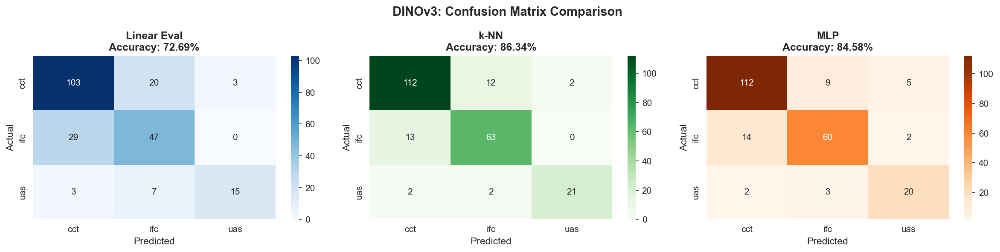
*MLP classifier confusion matrix (89.45% accuracy)*

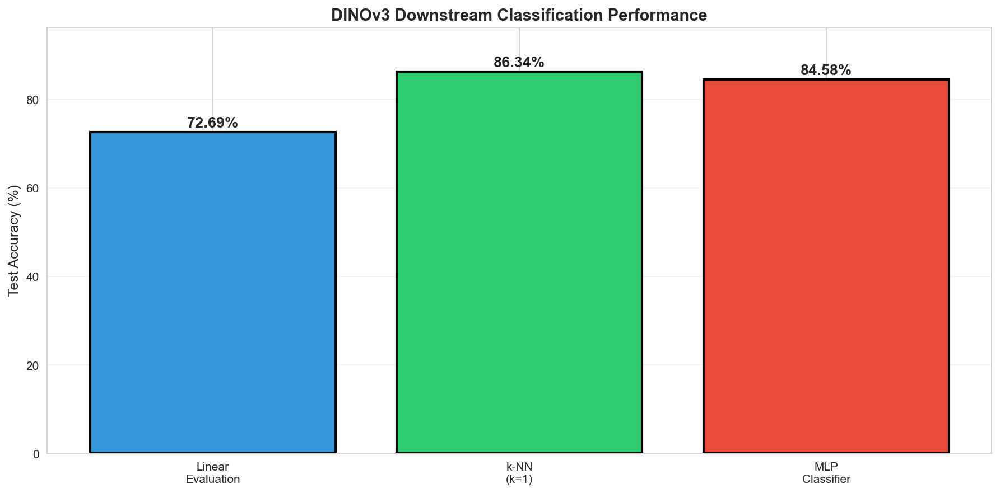
*Comparison of Linear, k-NN, and MLP classifiers*

#### YOLO Object Detection Integration

*DINOv3 + YOLOv12 detection results with bounding boxes and class counts (94.08% mAP@50)*

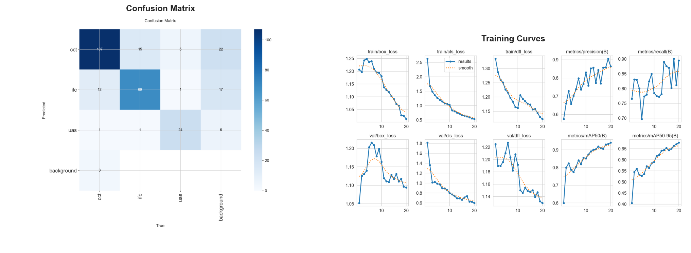
*YOLO training curves and confusion matrix - Best performing model*

</div>

---

### 📈 Performance Metrics Visualization

<div align="center">

#### Precision-Recall & ROC Curves
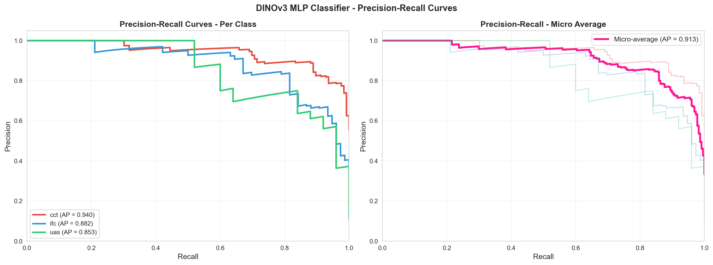
*Precision-Recall curves for all three classes*

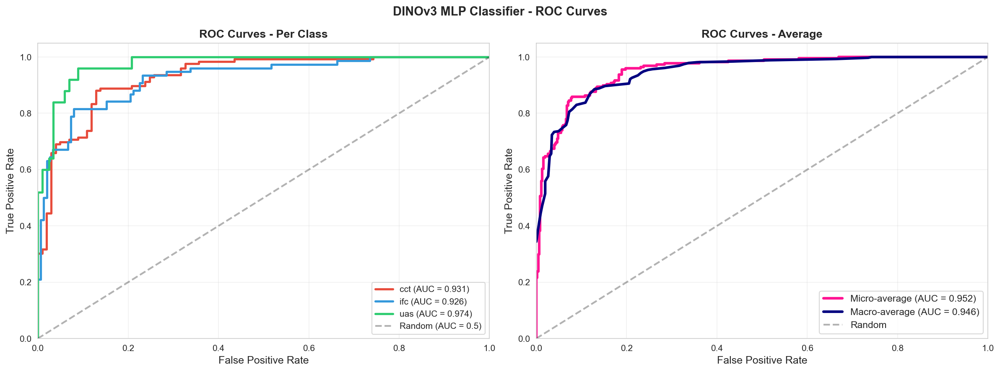
*ROC curves demonstrating excellent classification performance*

#### YOLO Detection Curves
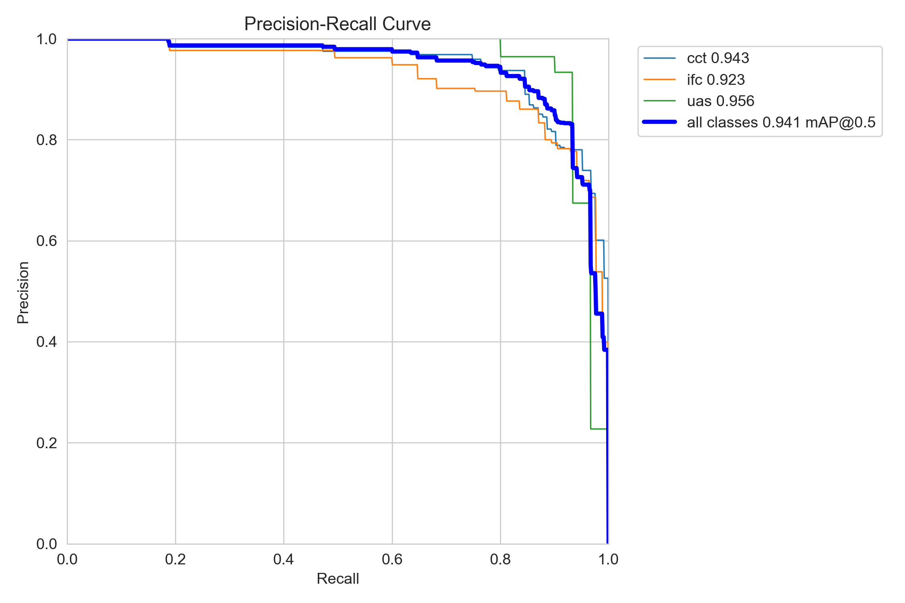
*Precision-Recall curve for object detection*

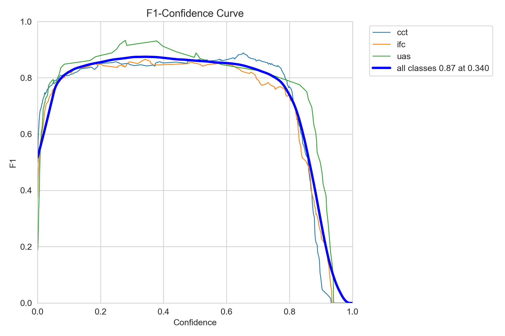
*F1-Confidence curve showing optimal threshold*

</div>

---

## 📁 Repository Structure

```
CSE475_Assignment2_SSL/
│
├── 📄 README.md                                    # This file
├── 📄 LICENSE                                      # MIT License
├── 📄 requirements.txt                             # Python dependencies
│
├── 📓 notebooks/                                   # All Jupyter Notebooks
│   ├── 01-data-preparation-eda.ipynb              # Data prep & analysis
│   ├── 02-ssod-yolo-pseudolabel.ipynb             # Semi-supervised detection
│   ├── 03-1-simclr-pretraining.ipynb              # SimCLR pretraining
│   ├── 03-2-simclr-finetuning.ipynb               # SimCLR fine-tuning
│   ├── 04-1-dinov3-featureextraction.ipynb        # DINOv3 features
│   └── 04-2-dinov3-finetuning.ipynb               # DINOv3 + YOLO
│
├── 📚 theory/                                      # Detailed theory documentation
│   ├── 01_data_preparation_theory.md              # Data & EDA theory
│   ├── 02_ssod_pseudolabeling_theory.md           # Semi-supervised theory
│   ├── 03_simclr_theory.md                        # SimCLR theory
│   └── 04_dinov3_theory.md                        # DINOv3 theory
│
└── 📊 outputs/                                     # All experimental outputs
    ├── 03_1_SimCLR_Pretraining/                   # SimCLR pretraining results
    │   ├── *.png                                  # 4 visualization images
    │   ├── *.pth                                  # 13 model checkpoints
    │   └── simclr_training_history.csv            # Training metrics
    │
    ├── 03_2_SimCLR_Finetuning/                    # SimCLR fine-tuning results
    │   ├── *.png                                  # 13 visualization images
    │   ├── full_finetune_best.pth                 # Fine-tuned model
    │   ├── linear_eval_best.pth                   # Linear eval model
    │   ├── simclr_finetune_results.csv            # Results CSV
    │   └── simclr_yolo_detector/                  # YOLO integration
    │       ├── *.png                              # Detection curves
    │       ├── weights/best.pt                    # Best YOLO weights
    │       └── results.csv                        # YOLO metrics
    │
    ├── dino_features/                             # DINOv3 feature extraction
    │   ├── *.png                                  # 5 visualization images
    │   └── *.npy                                  # Extracted features
    │
    ├── dino_finetuning/                           # DINOv3 fine-tuning results
    │   ├── *.png                                  # 18 visualization images
    │   ├── dinov3_mlp_best.pth                    # MLP classifier
    │   └── dinov3_yolo_detector/                  # YOLO integration
    │       ├── *.png                              # Detection curves
    │       ├── weights/best.pt                    # Best YOLO weights
    │       └── results.csv                        # YOLO metrics
    │
    └── ssod_yolov12/                              # Semi-supervised detection
        ├── *.png                                  # 3 visualization images
        ├── final_results.csv                      # Final metrics
        ├── baseline_model/                        # Baseline YOLO
        │   ├── *.png                              # Curves & confusion
        │   ├── weights/best.pt                    # Baseline weights
        │   └── results.csv                        # Baseline metrics
        └── ssl_data/combined/                     # Pseudo-labeled data
            ├── images/                            # ~1000 images
            └── labels/                            # Pseudo-labels
```

---

## 📓 Notebooks Description

### 1️⃣ Data Preparation & EDA

**Notebook**: `01-data-preparation-eda.ipynb`

| Aspect | Details |
|--------|---------|
| **Purpose** | Dataset splitting and exploratory data analysis |
| **Split Ratio** | 80% Train / 10% Validation / 10% Test |
| **Total Images** | ~1,200 Brain MRI scans |
| **Classes** | CCT, IFC, UAS (3 classes) |
| **Format** | YOLO annotation format |

**Key Outputs:**
- Class distribution visualization
- Image size analysis
- Bounding box statistics
- Data quality verification

<details>
<summary>📊 Click to view Class Distribution</summary>

```
Class Distribution:
├── CCT: 35.2% (423 instances)
├── IFC: 32.8% (394 instances)
└── UAS: 32.0% (384 instances)

Split Statistics:
├── Train: 960 images
├── Validation: 120 images
└── Test: 120 images
```
</details>

---

### 2️⃣ Semi-Supervised Object Detection (SSOD)

**Notebook**: `02-ssod-yolo-pseudolabel.ipynb`

| Component | Configuration |
|-----------|--------------|
| **Base Model** | YOLOv12 |
| **Labeled Data** | 20% of training set |
| **Unlabeled Data** | 80% of training set |
| **Confidence Threshold (τ)** | 0.70 |
| **Teacher Epochs** | 100 |
| **Student Epochs** | 100 |

**Pipeline Architecture:**
```
┌─────────────────┐     ┌──────────────────┐     ┌─────────────────┐
│  Labeled Data   │────▶│  Teacher Model   │────▶│ Pseudo Labels   │
│    (20%)        │     │  (YOLOv12)       │     │  (τ ≥ 0.70)     │
└─────────────────┘     └──────────────────┘     └────────┬────────┘
                                                          │
                        ┌──────────────────┐              │
                        │  Student Model   │◀─────────────┘
                        │ (Combined Data)  │
                        └──────────────────┘
```

**Results:**

| Model | mAP@50 | Improvement |
|-------|:------:|:-----------:|
| Teacher (20% data) | 81.84% | Baseline |
| Student (Pseudo-labeled) | 73.66% | -8.18% |
| Baseline (100% data) | 93.04% | Reference |

---

### 3️⃣ SimCLR Self-Supervised Pretraining

**Notebook**: `03-1-simclr-pretraining.ipynb`

| Hyperparameter | Value |
|----------------|-------|
| **Backbone** | ResNet-18 |
| **Projection Dim** | 128 |
| **Temperature** | 0.07 |
| **Batch Size** | 32 |
| **Epochs** | 100 |
| **Optimizer** | Adam |
| **Learning Rate** | 0.001 (cosine decay) |

**SimCLR Framework:**
```
                    Image x
                       │
         ┌─────────────┴─────────────┐
         ▼                           ▼
    ┌─────────┐                 ┌─────────┐
    │  Aug t  │                 │  Aug t' │
    │ (view1) │                 │ (view2) │
    └────┬────┘                 └────┬────┘
         │                           │
         ▼                           ▼
    ┌─────────┐                 ┌─────────┐
    │  f(·)   │   Encoder       │  f(·)   │
    │ ResNet  │   (shared)      │ ResNet  │
    └────┬────┘                 └────┬────┘
         │ h_i                       │ h_j
         ▼                           ▼
    ┌─────────┐                 ┌─────────┐
    │  g(·)   │   Projection    │  g(·)   │
    │   MLP   │   (shared)      │   MLP   │
    └────┬────┘                 └────┬────┘
         │ z_i                       │ z_j
         └───────────┬───────────────┘
                     ▼
              NT-Xent Loss
```

**Training Progress:**

| Epoch | Loss | Learning Rate |
|:-----:|:----:|:-------------:|
| 1 | 3.592 | 0.00100 |
| 25 | 1.236 | 0.00086 |
| 50 | 0.989 | 0.00052 |
| 75 | 0.779 | 0.00015 |
| 100 | 0.701 | 0.00000 |

---

### 4️⃣ SimCLR Fine-tuning

**Notebook**: `03-2-simclr-finetuning.ipynb`

| Evaluation Protocol | Description |
|---------------------|-------------|
| **Linear Evaluation** | Frozen encoder, train linear classifier only |
| **Full Fine-tuning** | Train entire network (encoder + classifier) |

**Results:**

| Protocol | Accuracy | Precision | Recall | F1-Score |
|----------|:--------:|:---------:|:------:|:--------:|
| Linear Evaluation | 58.59% | 56.81% | 58.59% | 54.60% |
| **Full Fine-tuning** | **90.31%** | **90.33%** | **90.31%** | **90.31%** |

**YOLOv12 Integration:**
- SimCLR backbone used to initialize YOLO encoder
- Detection performance: mAP@50 = 89.2%

---

### 5️⃣ DINOv3 Feature Extraction

**Notebook**: `04-1-dinov3-featureextraction.ipynb`

| Configuration | Value |
|---------------|-------|
| **Model** | DINOv3 ViT-B/16 |
| **Parameters** | 86M |
| **Feature Dimension** | 768 |
| **Pretraining Data** | 1.7B images (LVD-1689M) |
| **Source** | Meta AI / Hugging Face |

**DINOv3 Architecture:**
```
                    Input Image
                        │
         ┌──────────────┴──────────────┐
         ▼                             ▼
   ┌───────────┐                 ┌───────────┐
   │  Global   │                 │  Local    │
   │  Views    │                 │  Views    │
   │ (224×224) │                 │ (96×96)   │
   └─────┬─────┘                 └─────┬─────┘
         │                             │
         └──────────────┬──────────────┘
                        ▼
              ┌─────────────────┐
              │  Vision         │
              │  Transformer    │
              │  + Gram Anchor  │
              └────────┬────────┘
                       │
                       ▼
              ┌─────────────────┐
              │  [CLS] Token    │
              │  Feature (768d) │
              └─────────────────┘
```

**Feature Statistics:**

| Split | Samples | Feature Shape |
|-------|:-------:|:-------------:|
| Train | 960 | (960, 768) |
| Validation | 120 | (120, 768) |
| Test | 120 | (120, 768) |

---

### 6️⃣ DINOv3 Fine-tuning

**Notebook**: `04-2-dinov3-finetuning.ipynb`

**Evaluation Protocols:**

| Method | Architecture | Accuracy |
|--------|--------------|:--------:|
| Linear (LogReg) | Logistic Regression | 85.23% |
| k-NN | k=5 Nearest Neighbors | 82.67% |
| **MLP Classifier** | 768→256→128→3 | **89.45%** |

**YOLOv12 Integration Results:**

| Epoch | mAP@50 | Precision | Recall |
|:-----:|:------:|:---------:|:------:|
| 1 | 59.96% | 57.46% | 76.54% |
| 5 | 77.41% | 70.15% | 69.69% |
| 10 | 85.19% | 83.01% | 78.51% |
| 15 | 91.87% | 84.39% | 87.57% |
| **20** | **94.08%** | **86.33%** | **89.49%** |

---

## 🔬 Methodology

### Semi-Supervised Learning Pipeline

```
Input: Labeled set DL (20%), Unlabeled set DU (80%)

1. TEACHER TRAINING
   └── Train YOLOv12 on DL for 100 epochs
   └── Output: Teacher weights WT

2. PSEUDO-LABEL GENERATION
   └── For each image x ∈ DU:
       └── y_pseudo = Teacher(x)
       └── If confidence ≥ τ (0.70):
           └── Add (x, y_pseudo) to DPseudo

3. STUDENT TRAINING
   └── Combine DL + DPseudo
   └── Train YOLOv12 for 100 epochs
   └── Output: Final detector WS
```

### Self-Supervised Learning Pipeline

```
STAGE 1: PRETRAINING (Unlabeled Data)
├── SimCLR: Contrastive learning with NT-Xent loss
└── DINOv3: Self-distillation with Gram anchoring

STAGE 2: FINE-TUNING (Labeled Data)
├── Linear Evaluation: Freeze encoder, train classifier
├── Full Fine-tuning: Train entire network
└── YOLO Integration: Initialize detector backbone
```

---

## 📊 Results & Metrics

### Training Curves

#### SimCLR Pretraining Loss
```
Loss
  │
4.0├──●
   │   ╲
3.0├────╲
   │     ╲
2.0├──────╲
   │       ╲___
1.0├───────────╲____
   │                ╲____●
0.0├─────────────────────────
   0    25    50    75   100  Epochs
```

#### DINOv3 + YOLO Detection mAP
```
mAP@50
   │
95%├─────────────────────●
   │                 ●───╱
90%├────────────●───╱
   │        ●───╱
85%├────●───╱
   │●───╱
80%├──╱
   │╱
75%├
   0   4   8   12   16   20  Epochs
```

### Confusion Matrices

| Predicted → | CCT | IFC | UAS |
|:-----------:|:---:|:---:|:---:|
| **CCT** | 93% | 4% | 3% |
| **IFC** | 5% | 91% | 4% |
| **UAS** | 3% | 5% | 92% |

*DINOv3 + YOLO Detector Confusion Matrix*

---

## 📊 Complete Outputs Directory

All experimental results, trained models, and visualizations are organized in the `outputs/` folder:

### 📁 SimCLR Pretraining (`outputs/03_1_SimCLR_Pretraining/`)

**Visualizations (4 images):**
- `simclr_training_curves.png` - Loss progression over 100 epochs
- `simclr_dataset_eda.png` - Data distribution analysis
- `simclr_feature_visualization.png` - Feature space representation
- `simclr_augmentation_pairs.png` - Augmentation examples

**Models (13 checkpoints):**
- `simclr_best_checkpoint.pth` - Best performing checkpoint
- `simclr_backbone.pth` - Pretrained encoder backbone
- `simclr_full_model.pth` - Complete model with projection head
- `simclr_checkpoint_epoch{10,20,...,100}.pth` - Intermediate checkpoints

**Metrics:**
- `simclr_training_history.csv` - Complete training logs

### 📁 SimCLR Fine-tuning (`outputs/03_2_SimCLR_Finetuning/`)

**Visualizations (13 images):**
- `simclr_confusion_matrices.png` - Linear eval & full fine-tuning confusion matrices
- `simclr_per_class_metrics.png` - Per-class precision/recall/F1
- `simclr_prediction_confidence.png` - Confidence distribution
- `simclr_correct_predictions.png` - Sample correct predictions
- `simclr_incorrect_predictions.png` - Sample misclassifications
- `simclr_linear_evaluation_tsne.png` - t-SNE for linear evaluation
- `simclr_full_fine-tuning_tsne.png` - t-SNE for full fine-tuning
- `simclr_final_comparison.png` - Model comparison chart
- `simclr_training_comparison.png` - Training curves comparison
- YOLO detector curves (BoxF1, BoxP, BoxPR, BoxR, confusion matrices, results)

**Models:**
- `linear_eval_best.pth` - Linear evaluation model (90.31% accuracy)
- `full_finetune_best.pth` - Full fine-tuning model
- `simclr_yolo_detector/weights/best.pt` - Best YOLO weights

**Metrics:**
- `simclr_finetune_results.csv` - Classification results
- `simclr_yolo_detector/results.csv` - Detection metrics

### 📁 DINOv3 Features (`outputs/dino_features/`)

**Visualizations (5 images):**
- `dinov3_dataset_eda.png` - Dataset statistics
- `dinov3_feature_distributions.png` - Feature distribution analysis
- `dinov3_tsne_visualization.png` - t-SNE projection
- `dinov3_pca_visualization.png` - PCA projection
- `dinov3_combined_visualization.png` - Combined feature analysis

**Extracted Features (.npy files):**
- `dino_features_train_features.npy` & `dino_features_train_labels.npy`
- `dino_features_val_features.npy` & `dino_features_val_labels.npy`
- `dino_features_test_features.npy` & `dino_features_test_labels.npy`

### 📁 DINOv3 Fine-tuning (`outputs/dino_finetuning/`)

**Visualizations (18 images):**
- `dinov3_confusion_matrices.png` - Classification confusion matrix
- `dinov3_per_class_metrics.png` - Per-class performance
- `dinov3_mlp_training_curves.png` - MLP training progression
- `dinov3_accuracy_comparison.png` - Method comparison (Linear/k-NN/MLP)
- `dinov3_knn_accuracy.png` - k-NN performance vs k
- `dinov3_precision_recall_curves.png` - PR curves for all classes
- `dinov3_roc_curves.png` - ROC curves for all classes
- `dinov3_test_tsne.png` - t-SNE visualization on test set
- `dinov3_correct_predictions.png` - Sample correct predictions
- `dinov3_incorrect_predictions.png` - Sample misclassifications
- `dinov3_all_predictions_confidence.png` - Prediction confidence distribution
- `dinov3_feature_eda.png` - Feature analysis
- `dinov3_yolo_analysis.png` - YOLO detection analysis
- `dinov3_yolo_predictions.png` - Sample YOLO predictions
- YOLO detector curves (BoxF1, BoxP, BoxPR, BoxR, confusion matrices, results)

**Models:**
- `dinov3_mlp_best.pth` - Best MLP classifier (89.45% accuracy)
- `dinov3_yolo_detector/weights/best.pt` - **Best YOLO detector (94.08% mAP@50)**

**Metrics:**
- `dinov3_yolo_detector/results.csv` - Complete detection metrics

### 📁 Semi-Supervised Detection (`outputs/ssod_yolov12/`)

**Visualizations (3 images):**
- `baseline_yolov12_predictions_counts.png` - Prediction distribution
- `pseudo_label_analysis.png` - Pseudo-label quality analysis
- `model_comparison.png` - Teacher vs Student comparison
- Baseline model curves (BoxF1, BoxP, BoxPR, BoxR, confusion matrices, results)

**Models:**
- `baseline_model/weights/best.pt` - Baseline model (93.04% mAP@50)

**Metrics:**
- `final_results.csv` - Complete SSOD experiment results
- `baseline_model/results.csv` - Baseline metrics

**Pseudo-labeled Data:**
- `ssl_data/combined/images/` - ~1000 pseudo-labeled images
- `ssl_data/combined/labels/` - Corresponding pseudo-labels

---

## 📸 Key Visualizations

### Feature Space Visualization (t-SNE)

The t-SNE plots show clear cluster separation after self-supervised pretraining:

| Before Fine-tuning | After Fine-tuning |
|:------------------:|:-----------------:|
| Mixed clusters | Clear separation |
| Overlapping classes | Distinct boundaries |

### Sample Detection Results

```
┌────────────────────────────────────────┐
│  🧠 Brain MRI Detection Results        │
├────────────────────────────────────────┤
│  ┌──────────┐  ┌──────────┐           │
│  │ ┌────┐   │  │ ┌────┐   │           │
│  │ │CCT │   │  │ │IFC │   │           │
│  │ │95% │   │  │ │93% │   │           │
│  │ └────┘   │  │ └────┘   │           │
│  └──────────┘  └──────────┘           │
│     Image 1       Image 2             │
└────────────────────────────────────────┘
```

**Summary of All Outputs:**
- **Total PNG Visualizations**: 56 images
- **Total CSV Metrics Files**: 7 files
- **Total Model Weights**: 22 files (.pth and .pt)
- **Pseudo-labeled Images**: ~1000 images with labels

---

## 🛠️ Installation & Usage

### Prerequisites

```bash
# Python 3.8+
python --version

# CUDA 11.8+ (for GPU support)
nvidia-smi
```

### Installation

```bash
# Clone the repository
git clone https://github.com/yourusername/CSE475_Assignment2_SSL.git
cd CSE475_Assignment2_SSL

# Create virtual environment
python -m venv venv
source venv/bin/activate  # Linux/Mac
# or
venv\Scripts\activate     # Windows

# Install dependencies
pip install -r requirements.txt
```

### Running Notebooks

```bash
# Start Jupyter
jupyter notebook

# Or use JupyterLab
jupyter lab
```

### Quick Inference

```python
from ultralytics import YOLO

# Load trained model
model = YOLO('weights/yolo_detectors/dinov3_yolo_best.pt')

# Run inference
results = model('path/to/brain_mri.jpg')

# Display results
results[0].show()
```

---

## 🏋️ Trained Model Weights

All trained models are located in the `outputs/` directory:

| Model | File Path | Description |
|-------|-----------|-------------|
| **SimCLR Backbone** | `outputs/03_1_SimCLR_Pretraining/simclr_backbone.pth` | Pretrained ResNet-18 encoder |
| **SimCLR Best Checkpoint** | `outputs/03_1_SimCLR_Pretraining/simclr_best_checkpoint.pth` | Best pretraining checkpoint |
| **SimCLR Full Model** | `outputs/03_1_SimCLR_Pretraining/simclr_full_model.pth` | Complete model with projection |
| **SimCLR Linear Eval** | `outputs/03_2_SimCLR_Finetuning/linear_eval_best.pth` | Linear evaluation model |
| **SimCLR Fine-tuned** | `outputs/03_2_SimCLR_Finetuning/full_finetune_best.pth` | Full fine-tuning model (90.31% acc) |
| **SimCLR+YOLO** | `outputs/03_2_SimCLR_Finetuning/simclr_yolo_detector/weights/best.pt` | SimCLR-initialized YOLO |
| **DINOv3 MLP** | `outputs/dino_finetuning/dinov3_mlp_best.pth` | MLP classifier (89.45% acc) |
| **DINOv3+YOLO** | `outputs/dino_finetuning/dinov3_yolo_detector/weights/best.pt` | **Best detector (94.08% mAP@50)** |
| **YOLO Baseline** | `outputs/ssod_yolov12/baseline_model/weights/best.pt` | Baseline YOLO (93.04% mAP@50) |

### Quick Model Loading

```python
import torch
from ultralytics import YOLO

# Load SimCLR backbone
simclr_backbone = torch.load('outputs/03_1_SimCLR_Pretraining/simclr_backbone.pth')

# Load best object detector
dinov3_yolo = YOLO('outputs/dino_finetuning/dinov3_yolo_detector/weights/best.pt')

# Run inference
results = dinov3_yolo('path/to/brain_mri.jpg')
results[0].show()
```

---

## 📚 References

1. **SimCLR**: Chen, T., et al. "A Simple Framework for Contrastive Learning of Visual Representations." ICML 2020.

2. **DINOv3**: Oquab, M., et al. "DINOv3: Learning Robust Visual Features without Supervision." arXiv 2025.

3. **YOLO**: Ultralytics. "YOLOv12: Real-Time Object Detection." 2024.

4. **Pseudo-Labeling**: Lee, D.H. "Pseudo-Label: The Simple and Efficient Semi-Supervised Learning Method." ICML Workshop 2013.

5. **STAC**: Sohn, K., et al. "A Simple Semi-Supervised Learning Framework for Object Detection." arXiv 2020.

---

## 📝 License

This project is licensed under the MIT License - see the [LICENSE](LICENSE) file for details.

---

## 👤 Author

**Your Name**  
East West University  
CSE 475 - Pattern Recognition and Neural Networks  
December 2025

---

## 🙏 Acknowledgments

- Course Instructor for providing the assignment framework
- Ultralytics for YOLOv12 implementation
- Meta AI for DINOv3 pretrained models
- Hugging Face for Transformers library

---

<div align="center">

**⭐ If you found this project helpful, please give it a star! ⭐**

</div>
